<div align="center">

# 🚀 Embedded RTOS Kernel

### Lightweight Modular Real-Time Operating System written in C

<p align="center">

A lightweight educational Real-Time Operating System (RTOS) developed in pure C, demonstrating task scheduling, synchronization primitives, inter-process communication, software timers, event management, and modular kernel design.

</p>

---

<p align="center">


</p>

---

> **A modular Real-Time Operating System (RTOS) kernel built from scratch in C for learning modern embedded systems concepts including scheduling, IPC, synchronization, timers, and kernel architecture.**

</div>

---

# 👨‍💻 Author

## Vedula China Venkata Prasanth

**B.Tech – Electronics and Communication Engineering**

**Lendi Institute of Engineering and Technology**

📍 Vizianagaram, Andhra Pradesh, India

📧 **Email:** vprasanth302@gmail.com

🐙 **GitHub:** https://github.com/prasanth-vedula

---

# ⭐ Project Highlights

✔ Built completely in **C (C11)**

✔ Modular RTOS Kernel Architecture

✔ Priority-Based Task Scheduler

✔ Round Robin Scheduling

✔ Queue-Based Inter Process Communication (IPC)

✔ Binary & Counting Semaphores

✔ Mutex Synchronization

✔ Software Timers

✔ Event Flag Synchronization

✔ Dynamic Memory Manager

✔ Hardware Port Layer

✔ Dedicated Unit Test Suite

✔ Demonstration Applications

✔ Comprehensive Documentation

✔ GitHub Actions CI Ready

✔ CMake Build Support

---

# 📊 Project Metrics

| Category | Details |
|-----------|----------|
| Language | C (C11) |
| Build System | CMake |
| Compiler | GCC 16.1+ |
| RTOS Modules | 10 |
| Demo Applications | 5 |
| Unit Tests | 7 |
| Documentation Files | 5 |
| Screenshots | 15 |
| GitHub Workflows | 1 |
| Issue Templates | 2 |
| License | MIT |

---

# 📖 Table of Contents

- [Project Overview](#-project-overview)
- [Key Features](#-key-features)
- [Project Architecture](#-project-architecture)
- [Repository Structure](#-repository-structure)
- [Kernel Modules](#-kernel-modules)
- [Scheduler Workflow](#-scheduler-workflow)
- [Project Screenshots](#-project-screenshots)
- [Demo Gallery](#-demo-gallery)
- [Testing Gallery](#-testing-gallery)
- [Build Instructions](#-build-instructions)
- [Documentation](#-documentation)
- [Future Roadmap](#-future-roadmap)
- [Contributing](#-contributing)
- [License](#-license)

---

# 📌 Project Overview

Embedded systems often require deterministic execution, predictable scheduling, and efficient resource management. Real-Time Operating Systems (RTOS) provide these capabilities by coordinating tasks, managing synchronization, and enabling communication between software components.

This project demonstrates the design and implementation of a lightweight RTOS kernel developed entirely in C. It is organized into independent modules that implement the core building blocks of an RTOS, including scheduling, task management, inter-task communication, synchronization mechanisms, software timers, event handling, and memory management.

The project is intended as a learning-oriented implementation that emphasizes modular design, clean code organization, comprehensive documentation, and testing. It serves as a practical reference for students and developers exploring embedded software engineering concepts.

---

# ✨ Key Features

## Kernel

- Kernel initialization
- Start/Stop control
- Modular architecture

## Scheduler

- Priority-based scheduling
- Round Robin scheduling
- Tick-driven scheduling
- Context switching
- Runtime statistics

## Task Management

- Task creation
- Task deletion
- Suspend/Resume support
- Priority management

## Queue

- FIFO communication
- Send/Receive operations
- Queue reset
- Status monitoring

## Synchronization

- Binary Semaphore
- Counting Semaphore
- Mutex Lock/Unlock
- Event Flags

## Timer

- One-shot timers
- Periodic timers
- Callback execution
- Restart support

## Additional Components

- Memory Manager
- Port Layer
- Kernel Hooks
- Modular Documentation
- Unit Testing Framework
---

# 🏗️ Project Architecture

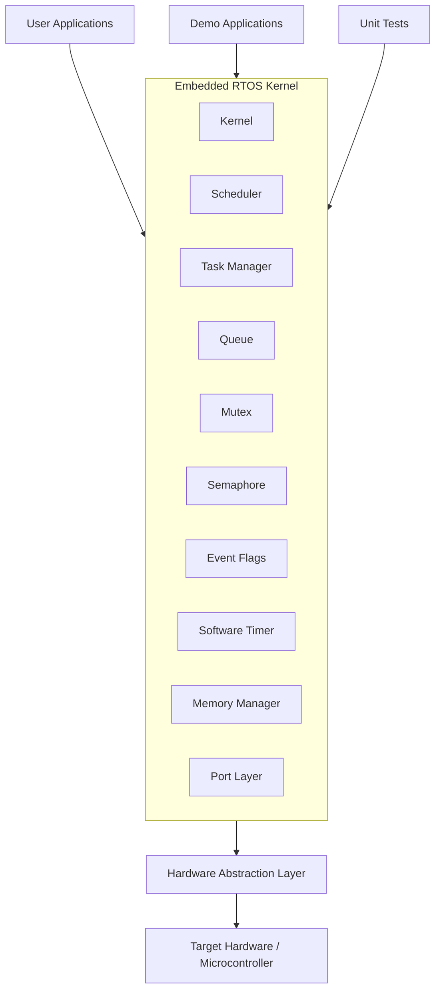

---

# 🧩 Kernel Module Overview

| Module | Purpose |
|---------|----------|
| **Kernel** | Initializes and controls the RTOS lifecycle |
| **Scheduler** | Selects the next task for execution |
| **Task Manager** | Creates, deletes, suspends, and resumes tasks |
| **Queue** | FIFO communication between tasks |
| **Semaphore** | Synchronization between concurrent tasks |
| **Mutex** | Mutual exclusion for shared resources |
| **Event Flags** | Event-based task synchronization |
| **Software Timer** | Time-based callback execution |
| **Memory Manager** | Dynamic memory allocation support |
| **Port Layer** | Hardware abstraction interface |

---

# 🔄 Scheduler Workflow

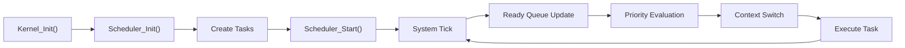

---

# ⚙️ Scheduler Features

- Priority-Based Scheduling
- Round Robin Scheduling
- Tick Driven Execution
- Context Switching
- Ready Queue Management
- Runtime Statistics
- Idle Task Handling

---

# 📂 Repository Structure

```text
embedded-rtos-kernel/

├── .github/
│   ├── workflows/
│   ├── ISSUE_TEMPLATE/
│   └── pull_request_template.md
│
├── docs/
│   ├── API.md
│   ├── Architecture.md
│   ├── Building.md
│   ├── Testing.md
│   └── scheduler.md
│
├── examples/
│   ├── queue_demo.c
│   ├── semaphore_demo.c
│   ├── mutex_demo.c
│   ├── timer_demo.c
│   └── event_demo.c
│
├── kernel/
│   ├── Inc/
│   └── Src/
│
├── tests/
│
├── screenshots/
│
├── README.md
├── CHANGELOG.md
├── LICENSE
├── CMakeLists.txt
└── .gitignore
```

---

# 🚀 Getting Started

## Clone the Repository

```bash
git clone https://github.com/prasanth-vedula/embedded-rtos-kernel.git

cd embedded-rtos-kernel
```

---

## Build Using CMake

```bash
mkdir build

cd build

cmake ..

cmake --build .
```

---

## Compile Manually

Example:

```bash
gcc -Ikernel/Inc kernel/Src/*.c examples/queue_demo.c -o queue_demo
```

---

## Execute

```bash
./queue_demo
```

---

# 📚 Documentation

Detailed project documentation is available in the **docs/** directory.

| Document | Description |
|-----------|-------------|
| API.md | Public API reference |
| Architecture.md | Kernel architecture |
| scheduler.md | Scheduler design |
| Building.md | Build guide |
| Testing.md | Unit testing guide |

---

# 🧪 Testing

The project includes dedicated unit tests for every major subsystem.

| Module | Status |
|---------|--------|
| Kernel | ✅ PASS |
| Scheduler | ✅ PASS |
| Queue | ✅ PASS |
| Semaphore | ✅ PASS |
| Mutex | ✅ PASS |
| Timer | ✅ PASS |
| Event | ✅ PASS |

**Overall Result:** ✅ All tests passed successfully.
---

# 📸 Project Screenshots

The following screenshots showcase the project structure, development environment, demonstrations, and unit testing results.

---

# 🗂️ Project Structure

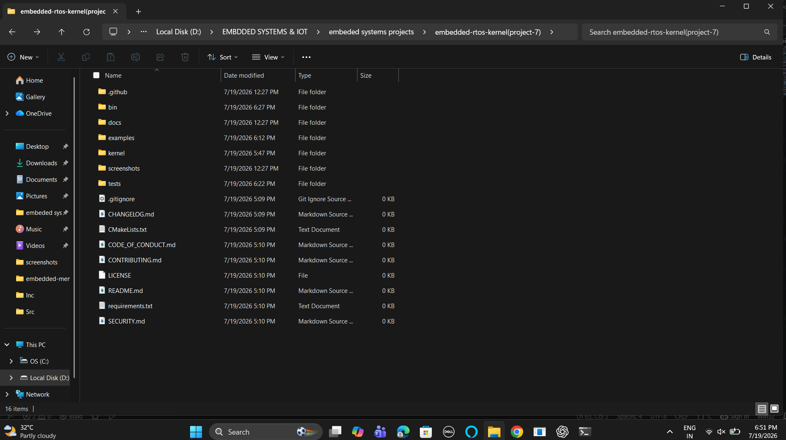

---

# 📁 Kernel Structure

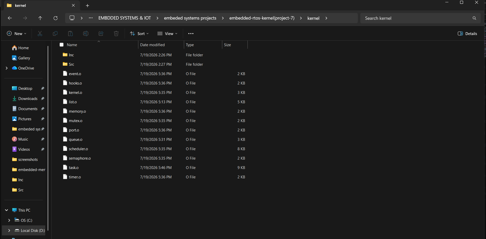

---

# 💻 Development Workspace

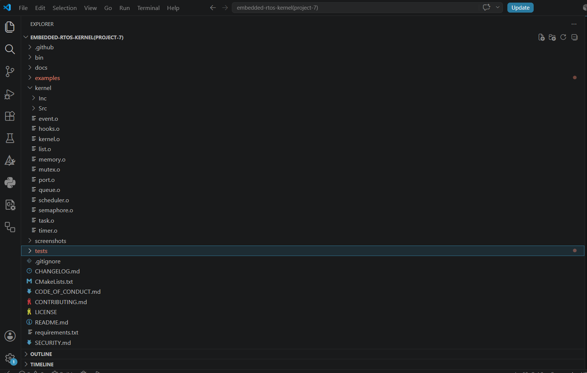

---

# 🎮 Demo Gallery

The project includes demonstration programs for validating each RTOS module.

## Queue Demo

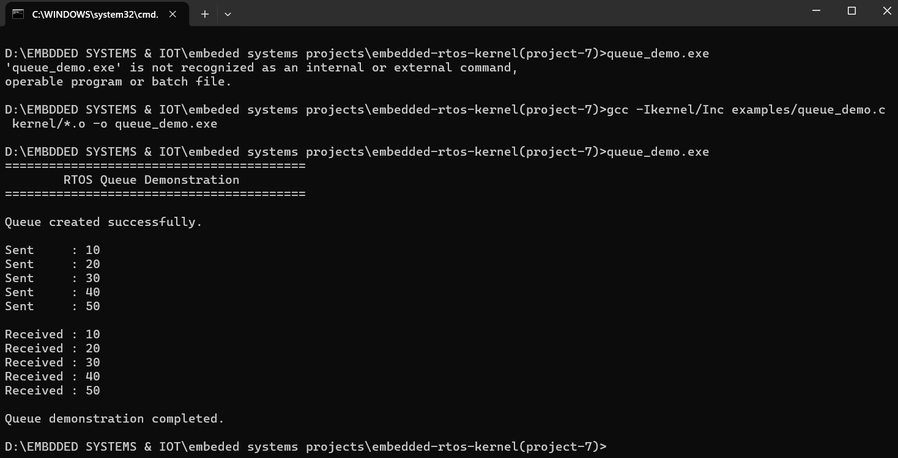

---

## Semaphore Demo

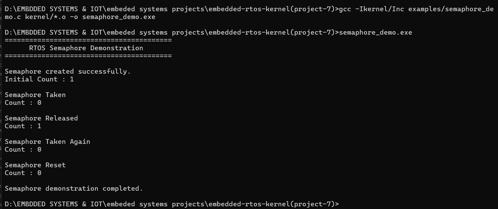

---

## Mutex Demo

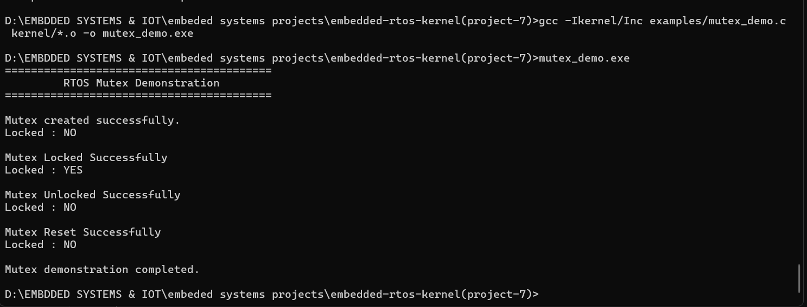

---

## Timer Demo

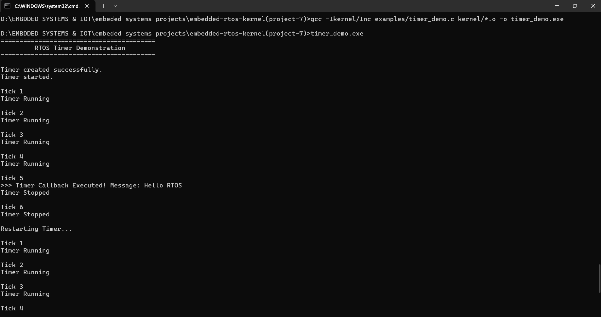

---

## Event Demo

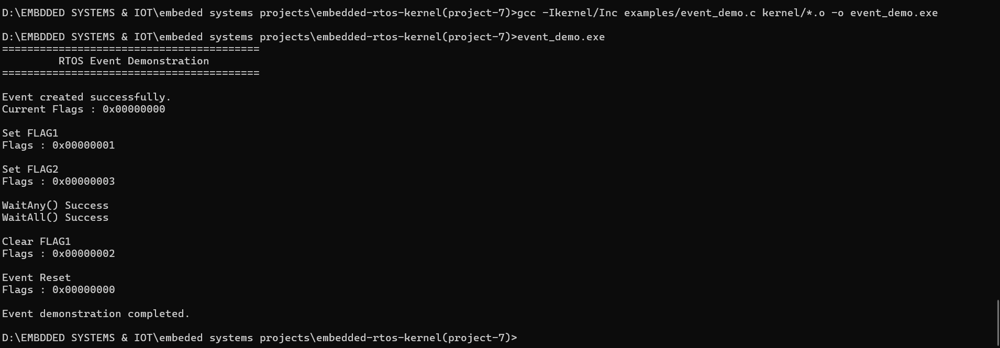

---

# 🧪 Unit Test Gallery

Every major RTOS module includes an independent unit test.

---

## Kernel Test

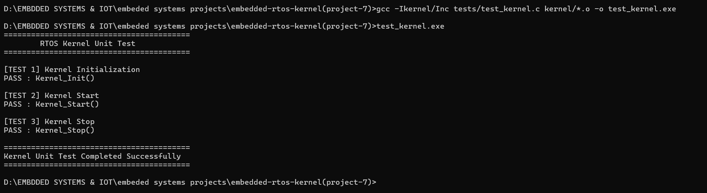

---

## Scheduler Test

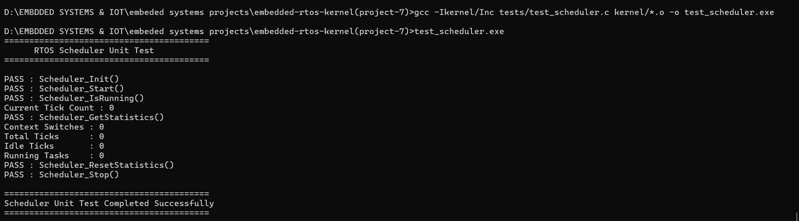

---

## Queue Test

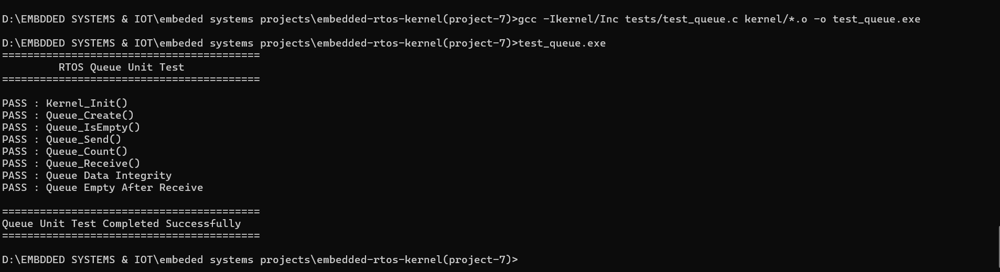

---

## Semaphore Test

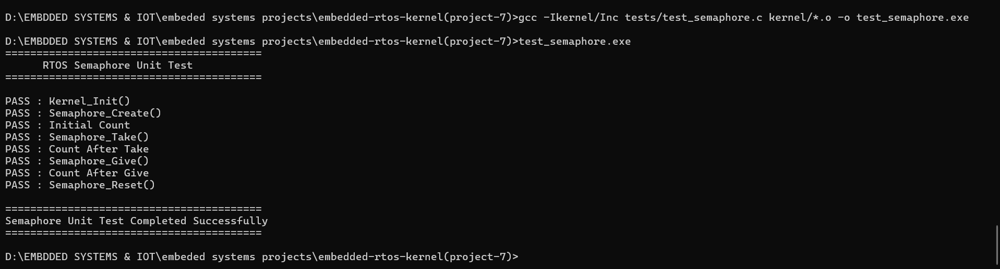

---

## Mutex Test

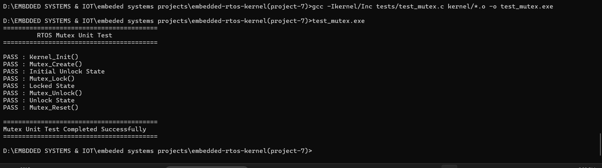

---

## Timer Test

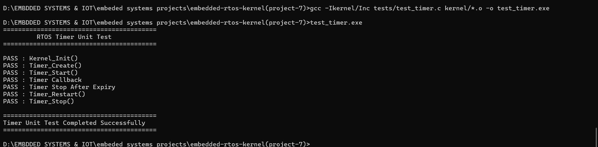

---

## Event Test

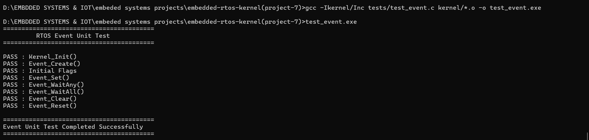

---

# 📈 Project Statistics

| Metric | Value |
|----------|------:|
| Programming Language | C11 |
| Build System | CMake |
| Compiler | GCC 16.1+ |
| Kernel Modules | 10 |
| Demo Applications | 5 |
| Unit Tests | 7 |
| Documentation Files | 5 |
| GitHub Workflows | 1 |
| Screenshots | 15 |
| License | MIT |
| Repository Status | Stable |

---

# 🎯 Learning Outcomes

This project demonstrates practical understanding of:

- Real-Time Operating Systems
- Embedded C Programming
- Task Scheduling
- Context Switching
- Inter-Task Communication
- Queue Management
- Mutex Synchronization
- Binary & Counting Semaphores
- Event-Driven Programming
- Software Timers
- Memory Management
- Embedded Software Architecture
- Modular Software Design
- Unit Testing
- Technical Documentation
- GitHub Workflows
- CMake Build Systems

---

# 💼 Skills Demonstrated

This project showcases experience with:

- Embedded Systems Development
- RTOS Fundamentals
- Firmware Architecture
- Concurrent Programming
- Synchronization Mechanisms
- Software Engineering Best Practices
- Version Control (Git)
- Continuous Integration (GitHub Actions)
- Project Documentation
- Open Source Repository Management
---

# 🗺️ Project Roadmap

## Completed ✅

- [x] Modular RTOS Kernel
- [x] Priority-Based Scheduler
- [x] Round Robin Scheduling
- [x] Task Management
- [x] Queue (FIFO IPC)
- [x] Binary Semaphore
- [x] Counting Semaphore
- [x] Mutex Synchronization
- [x] Event Flags
- [x] Software Timers
- [x] Memory Manager
- [x] Port Layer
- [x] Unit Testing
- [x] Documentation
- [x] GitHub Actions CI
- [x] CMake Build Support

---

## Future Improvements 🚀

The following enhancements are planned for future versions:

- [ ] Priority Inheritance
- [ ] Static Task Allocation
- [ ] Tickless Idle Mode
- [ ] Message Buffers
- [ ] Stream Buffers
- [ ] Memory Pool Allocator
- [ ] Software Trace Hooks
- [ ] POSIX Compatibility Layer
- [ ] SMP (Multi-Core) Scheduling
- [ ] CPU Load Monitoring
- [ ] Runtime Profiling
- [ ] Additional Example Applications

---

# 📚 Documentation Index

| Document | Purpose |
|----------|---------|
| `docs/API.md` | Public API Reference |
| `docs/Architecture.md` | RTOS Architecture |
| `docs/scheduler.md` | Scheduler Design |
| `docs/Building.md` | Build Instructions |
| `docs/Testing.md` | Testing Guide |

---

# 📦 Repository Features

This repository includes:

- ✅ GitHub Actions Continuous Integration
- ✅ Issue Templates
- ✅ Pull Request Template
- ✅ Security Policy
- ✅ Contribution Guidelines
- ✅ Changelog
- ✅ MIT License
- ✅ Professional Documentation
- ✅ Unit Test Suite
- ✅ Demonstration Applications

---

<details>

<summary><b>📸 Demo Gallery (Click to Expand)</b></summary>

<br>

### Queue Demo


### Semaphore Demo


### Mutex Demo


### Timer Demo


### Event Demo


</details>

---

<details>

<summary><b>🧪 Unit Test Gallery (Click to Expand)</b></summary>

<br>

### Kernel Test


### Scheduler Test


### Queue Test


### Semaphore Test


### Mutex Test


### Timer Test


### Event Test


</details>

---

# 🤝 Contributing

Contributions that improve the project are always welcome.

If you would like to contribute:

1. Fork the repository.
2. Create a feature branch.
3. Commit your changes.
4. Submit a Pull Request.

Please follow the coding standards and update documentation where applicable.

---

# 🙏 Acknowledgements

This project was developed as part of my exploration of:

- Embedded Systems
- Embedded C Programming
- Real-Time Operating Systems
- Operating System Concepts
- Software Engineering Practices

It serves as a practical implementation of RTOS fundamentals and a learning resource for students and embedded developers.

---

# 📜 License

This project is licensed under the **MIT License**.

See the `LICENSE` file for more information.

---

# 📬 Contact

**Vedula China Venkata Prasanth**

🎓 B.Tech – Electronics and Communication Engineering

🏫 Lendi Institute of Engineering and Technology

📍 Vizianagaram, Andhra Pradesh, India

📧 Email: **vprasanth302@gmail.com**

🐙 GitHub: **https://github.com/prasanth-vedula**

---

<div align="center">

# ⭐ Thank You for Visiting!

If you found this project useful or interesting, consider giving it a ⭐ on GitHub.

Your feedback, suggestions, and contributions are always appreciated.

---

**Designed and Developed by Vedula China Venkata Prasanth**

</div>